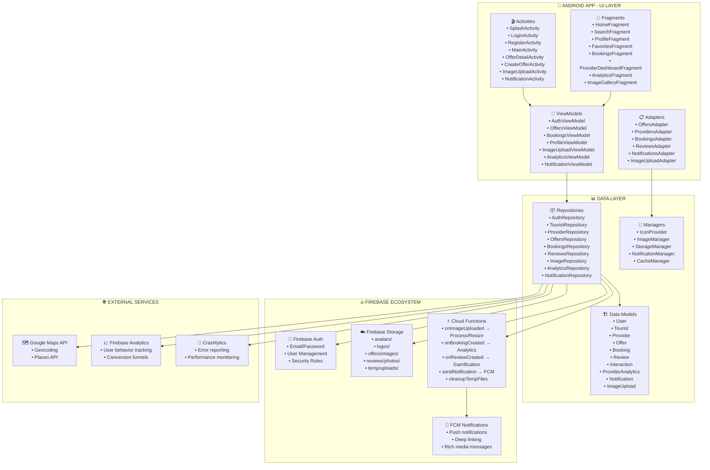

#  MunyaTrip – Plataforma de Turismo 

> **"Descubre Perú como nunca antes: experiencias auténticas, locales y con sentido."**

[](LICENSE)

## 🔍 Descripción

**MunyaTrip** es una aplicación móvil para Android que conecta turistas con proveedores locales (hoteles, restaurantes, tours, municipios, etc.) en diferentes regiones de Perú. La app permite:

- Descubrir ofertas culturales, gastronómicas y de aventura.
- Reservar experiencias directamente con proveedores.
- Dejar reseñas y calificar servicios.
- Seguirlas a través de notificaciones inteligentes.
- Participar en un sistema de gamificación (puntos, niveles, badges).
- Analizar métricas de desempeño para proveedores.

La plataforma se construye sobre **Firebase** (Auth, Firestore, Storage, Cloud Functions, FCM).

---

## Arquitectura General

La arquitectura sigue un patrón **Clean Architecture** con capas bien definidas:

```
┌──────────────────────────────┐
│     UI Layer                 │
│   ┌─────────────┐            │
│   │ Activities  │            │
│   │ Fragments   │            │
│   │ Adapters    │            │
│   │ ViewModels  │            │
│   └─────────────┘            │
│                              │
├──────────────────────────────┤
│       DATA Layer             │
│   ┌─────────────┐            │
│   │ Repositories│            │
│   │ Models      │            │
│   │ Managers    │            │
│   └─────────────┘            │
│                              │
└──────────────────────────────┘
        ↑
        ↓
┌──────────────────────────────┐
│     FIREBASE ECOSYSTEM       │
│   ┌───────────────────┐      │
│   │ Auth              │      │
│   │ Firestore         │      │
│   │ Storage           │      │
│   │ Cloud Functions   │      │
│   │ FCM Notifications │      │
│   └───────────────────┘      │
└──────────────────────────────┘
```

---

## Diagrama de Arquitectura (Mermaid)



---

## Estructura de Directorios

```
MunayTripAndroid/
├── app/
│   ├── src/main/java/
│   │   ├── com/dsm/munaytripndroid/
│   │   │   ├── core/
│   │   │   │   ├── di/ 
│   │   │   │   ├── navigation/ 
│   │   │   │   ├── theme/
│   │   │   │   │   ├── Color.kt
│   │   │   │   │   ├── Theme.kt
│   │   │   │   │   └── Type.kt 
│   │   │   │   └── utils/                
│   │   │   ├── data/                # Repositories, Models, Managers
│   │   │   ├── domain/              # Entidades de negocio (DTOs)
│   │   │   ├── presenttion/
│   │   │   │   ├── auth/              
│   │   │   │   │   ├── ui/              
│   │   │   │   │   └── viewmodel/
│   │   │   │   ├── home/              
│   │   │   │   │   ├── ui/              
│   │   │   │   │   └── viewmodel/
│   │   │   │   ├── splash/              
│   │   │   │   ├── .../                          
│   │   │   └── BuildConfig.java
│   ├── res/
│   │   ├── drawable/                 # Iconos, imágenes
│   │   ├── layout/                   # XML de vistas
│   │   └── values/                   # Strings, colors, styles
│   └── AndroidManifest.xml
├── firebase/
│   ├── firestore.rules
│   └── storage.rules
├── docs/
│   ├── dbml/                       # DBML files
│   └── diagrams/                   # Diagramas Mermaid/PNG
├── scripts/
│   └── init-data.js                # Script de carga inicial
├── README.md
└── LICENSE
```

---

## Relaciones Clave entre Colecciones (Firestore)

| Relación | Descripción |
|--------|-----------|
| `users.user_id → tourists.tourist_id` | Un usuario puede ser turista. |
| `users.user_id → providers.provider_id` | Un usuario puede ser proveedor. |
| `providers.provider_id → offers.offer_id` | Un proveedor publica ofertas. |
| `tourists.tourist_id → bookings.booking_id` | Un turista reserva ofertas. |
| `offers.offer_id → bookings.booking_id` | Una oferta puede tener múltiples reservas. |
| `bookings.booking_id → reviews.review_id` | Una reserva genera una reseña. |
| `tourists.tourist_id → favorites.favorite_id` | Un turista agrega ofertas a favoritos. |
| `offers.offer_id → favorites.favorite_id` | Una oferta puede estar en favoritos. |
| `users.user_id → interactions.interaction_id` | Un usuario interactúa con ofertas. |
| `offers.offer_id → interactions.interaction_id` | Una oferta recibe interacciones. |
| `providers.provider_id → provider_analytics.analytics_id` | Un proveedor tiene métricas. |
| `users.user_id → notifications.notification_id` | Un usuario recibe notificaciones. |

---

## 📦 Modelo de Datos (Ejemplo JSON)

```json
{
  "users": {
    "usr_turista_001": {
      "user_id": "usr_turista_001",
      "email": "fernando.rojas@gmail.com",
      "user_type": "tourist",
      "estado": "activo",
      "profile_image_url": "gs://munaytrip-app.appspot.com/users/avatars/usr_turista_001/profile.jpg",
      "created_at": { "_seconds": 1717200000, "_nanoseconds": 0 }
    }
  },
  "tourists": {
    "usr_turista_001": {
      "tourist_id": "usr_turista_001",
      "nombre": "Fernando Rojas",
      "preferencias": ["cultura", "gastronomia"],
      "puntos": 275,
      "nivel": 2,
      "badges": ["explorador", "foodie"],
      "avatar_url": "gs://munaytrip-app.appspot.com/users/avatars/usr_turista_001/avatar_512.jpg",
      "ubicacion_actual": { "_latitude": -12.0464, "_longitude": -77.0428 }
    }
  },
  "offers": {
    "ofr_feria_artesanal_2025": {
      "offer_id": "ofr_feria_artesanal_2025",
      "provider_id": "usr_provider_001",
      "titulo": "Feria Artesanal de la Confraternidad",
      "descripcion_corta": "Encuentro cultural con artesanos locales.",
      "categoria": "cultural",
      "precio": 0.0,
      "images_urls": [
        "gs://munaytrip-app.appspot.com/offers/images/ofr_feria_artesanal_2025/main_1920x1080.jpg"
      ],
      "created_at": { "_seconds": 1717286400, "_nanoseconds": 0 }
    }
  }
}
```

---

## Flujo de Imágenes (Storage + Cloud Functions)

1. El proveedor sube imágenes desde `ImageUploadActivity`.
2. Las imágenes van a `storage/temp/uploads/{session_id}`.
3. Se activa `Cloud Function onImageUploaded`.
4. La función:
   - Procesa, redimensiona y optimiza las imágenes.
   - Genera thumbnails.
   - Guarda en `offers/images/{offer_id}/`.
   - Actualiza el documento de `offers` con URLs.
5. Se envía notificación al proveedor.

---

## Tecnologías Usadas

| Capa | Tecnología |
|------|----------|
| **Frontend** | Android (Kotlin, Jetpack Compose, MVVM) |
| **Backend** | Firebase (Auth, Firestore, Storage, Cloud Functions) |
| **Notificaciones** | FCM (Firebase Cloud Messaging) |
| **Mapas** | Google Maps API (Geocoding, Places) |
| **Analítica** | Firebase Analytics, Crashlytics |
| **Imagenes** | Glide (cache), Firebase Storage |
| **Arquitectura** | Clean Architecture, Repository Pattern, Hilt |

---

## Cómo Contribuir

1. Fork este repositorio.
2. Crea una rama nueva (`feature/new-feature`).
3. Haz tus cambios y commit.
4. Haz un pull request.

---

## 📄 Licencia

Este proyecto está bajo licencia **MIT** — vea el archivo [LICENSE](LICENSE) para más detalles.
---

## Contacto

Para sugerencias, reportar errores o colaborar:

📧 cgfernando.4799@gmail.com
🌐 https://munyatrip.app

---

> ✅ **Este proyecto es parte de una iniciativa de inclusión digital y promoción del turismo local sostenible en regiones de Perú.**

---